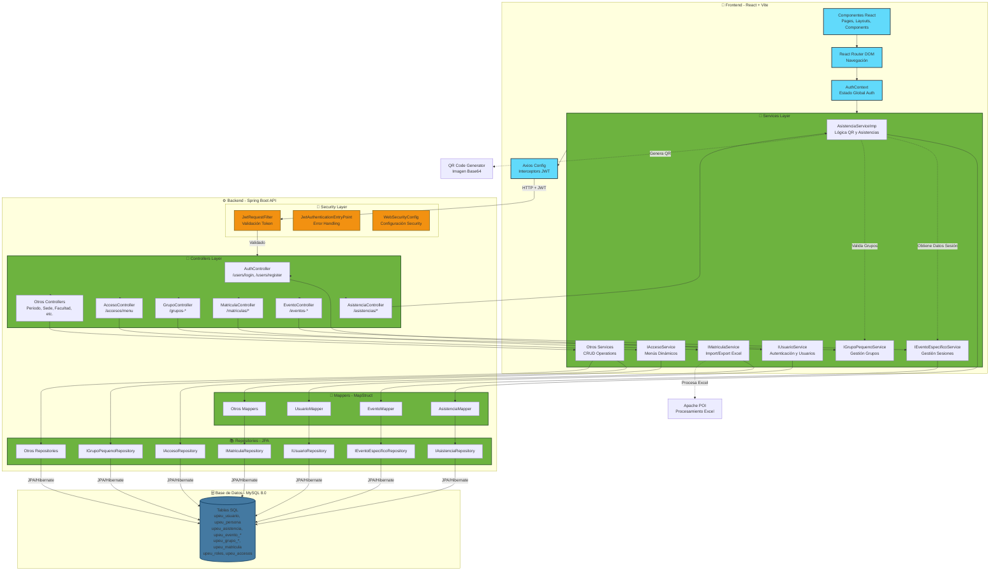
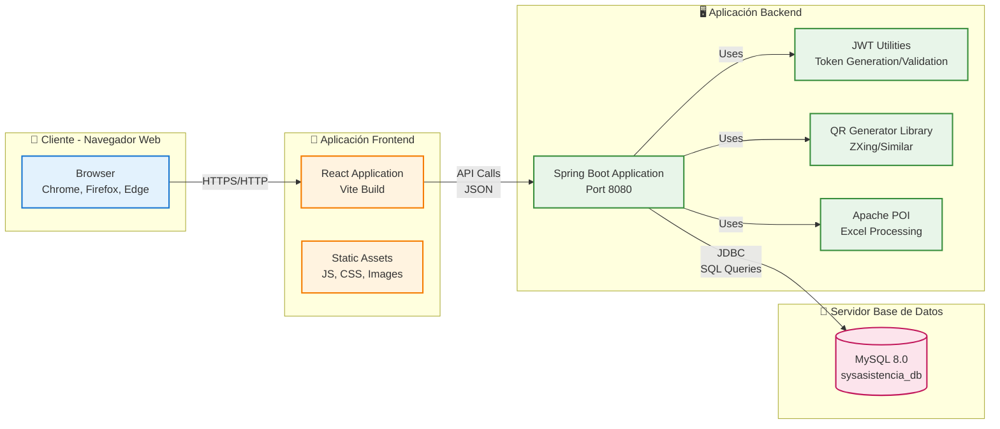
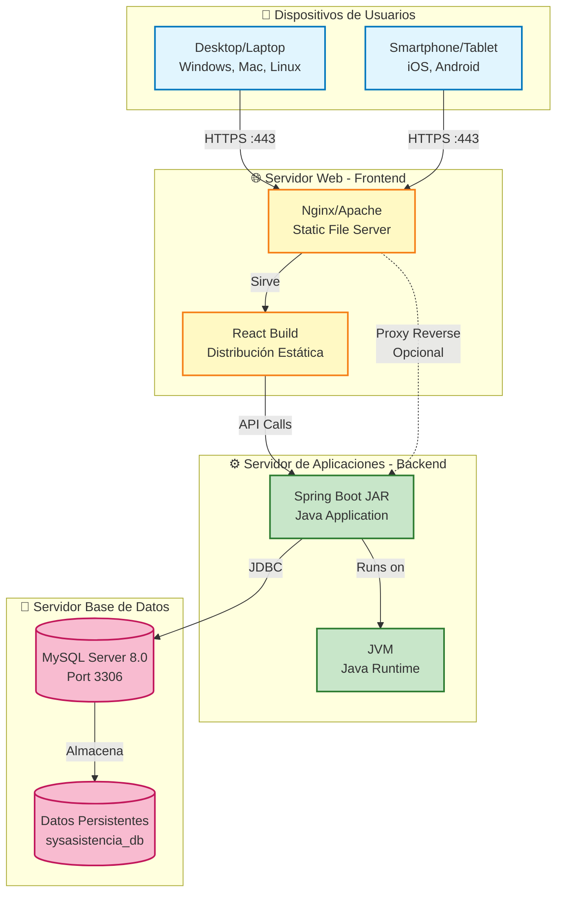

# Arquitectura del Sistema de Asistencia - UPeU

## 1. ARQUITECTURA DEL SISTEMA (Explicación Completa)

### 1.1. Visión General

El Sistema de Asistencia UPeU es una aplicación web full-stack basada en una arquitectura cliente-servidor con separación clara de responsabilidades entre frontend y backend. La arquitectura sigue el patrón de capas tradicional (Controller-Service-Repository) en el backend y una arquitectura basada en componentes con gestión de estado reactiva en el frontend.

### 1.2. Estructura de Capas del Backend

#### **Capa de Presentación (Controllers)**
- **Tecnología**: Spring Boot `@RestController`
- **Responsabilidad**: Recibe peticiones HTTP, valida datos de entrada, delega la lógica de negocio a los servicios, y retorna respuestas HTTP formateadas.
- **Componentes**: `AccesoController`, `AsistenciaController`, `AuthController`, `EventoEspecificoController`, `EventoGeneralController`, `FacultadController`, `GrupoGeneralController`, `GrupoParticipanteController`, `GrupoPequenoController`, `MatriculaController`, `PeriodoController`, `PersonaController`, `ProgramaEstudioController`, `SedeController`, `UsuarioController`
- **Comunicación**: Expone endpoints REST sobre HTTP/HTTPS, utiliza `@CrossOrigin(origins = "*")` para permitir solicitudes desde el frontend.

#### **Capa de Servicio (Services)**
- **Tecnología**: Spring Framework Services (`@Service`)
- **Responsabilidad**: Implementa la lógica de negocio, coordina múltiples repositorios, aplica validaciones de negocio, transforma entidades a DTOs mediante mappers, y gestiona transacciones.
- **Componentes Clave**:
  - `AsistenciaServiceImp`: Genera códigos QR para sesiones, valida registros de asistencia, procesa escaneo QR, genera reportes.
  - `IUsuarioService`: Autenticación, registro de usuarios, gestión de roles.
  - `IAccesoService`: Construcción de menús dinámicos basados en roles del usuario.
  - `IMatriculaService`: Importación/exportación de Excel, procesamiento de archivos multipart.
  - Otros servicios CRUD: `IEventoGeneralService`, `IEventoEspecificoService`, `IGrupoPequenoService`, `IGrupoParticipanteService`, etc.

#### **Capa de Persistencia (Repositories)**
- **Tecnología**: Spring Data JPA (`ICrudGenericoRepository` extends `JpaRepository`)
- **Responsabilidad**: Abstrae el acceso a datos, proporciona consultas personalizadas mediante `@Query` y métodos de búsqueda derivados, gestiona entidades JPA.
- **Componentes**: Interfaces como `IAsistenciaRepository`, `IUsuarioRepository`, `IEventoGeneralRepository`, `IMatriculaRepository`, etc.
- **Acceso a Datos**: Utiliza JPA/Hibernate para mapeo objeto-relacional y ejecución de queries SQL nativas o JPQL.

#### **Capa de Modelo (Entities/Models)**
- **Tecnología**: JPA Entities (`@Entity`, `@Table`)
- **Responsabilidad**: Representa la estructura de datos de la base de datos, define relaciones entre entidades (`@ManyToOne`, `@OneToOne`, `@OneToMany`), y gestiona el ciclo de vida de las entidades.
- **Componentes**: `Usuario`, `Persona`, `Rol`, `Acceso`, `Asistencia`, `EventoGeneral`, `EventoEspecifico`, `GrupoGeneral`, `GrupoPequeno`, `GrupoParticipante`, `Matricula`, `Periodo`, `Sede`, `Facultad`, `ProgramaEstudio`.

#### **Capa de DTOs (Data Transfer Objects)**
- **Tecnología**: Clases POJO con Lombok (`@Data`, `@Builder`)
- **Responsabilidad**: Transferir datos entre capas sin exponer la estructura interna de las entidades, reducir el acoplamiento, y optimizar transferencias de red.
- **Componentes**: `UsuarioDTO`, `AsistenciaDTO`, `AsistenciaRegistroDTO`, `EventoGeneralDTO`, `EventoEspecificoDTO`, `QRAsistenciaDTO`, `MenuGroup`, `MenuItem`, `MatriculaDTO`, `ParticipanteAsistenciaDTO`, `ReporteAsistenciaDTO`, etc.

#### **Capa de Mapeo (Mappers)**
- **Tecnología**: MapStruct (`@Mapper`)
- **Responsabilidad**: Transformar automáticamente entre entidades y DTOs, reducir código boilerplate, y mantener la separación entre modelo de dominio y DTOs.
- **Componentes**: Interfaces como `AsistenciaMapper`, `UsuarioMapper`, `EventoGeneralMapper`, `EventoEspecificoMapper`, `MatriculaMapper`, etc.

### 1.3. Estructura del Frontend

#### **Capa de Presentación (Pages/Components)**
- **Tecnología**: React 19 con Vite
- **Responsabilidad**: Renderizar la interfaz de usuario, gestionar el estado local de componentes, capturar interacciones del usuario, y comunicarse con servicios para obtener/enviar datos.
- **Componentes**: 
  - Layout: `MainLayout`, `Navbar`, `Sidebar`, `Modal`
  - Páginas Admin: `AdminDashboardPage`, `EventosGeneralesPage`, `SesionesPage`, `Matriculas`, `ImportarExcelPage`, `GruposGeneralesPage`, `GruposPequenosPage`, `ReportesPage`
  - Páginas Líder: `LiderDashboardPage`, `RegistrarAsistenciaPage`, `MisGruposPage`, `VerAsistenciasPage`, `MisAsistenciasPage`
  - Páginas Integrante: `IntegranteDashboardPage`, `EscanearQRPage`
  - Autenticación: `LoginPage`, `RegisterPage`

#### **Capa de Servicios (Services)**
- **Tecnología**: JavaScript ES6+ con Axios
- **Responsabilidad**: Encapsular llamadas HTTP al backend, transformar datos si es necesario, manejar errores de red, y proporcionar una API limpia a los componentes.
- **Componentes**: 
  - `authService.js`: Autenticación y registro
  - `asistenciaService.js`: Generación QR, registro de asistencias, listas de llamado
  - `eventoGeneralService.js`: Gestión de eventos generales
  - `eventoEspecificoService.js`: Gestión de sesiones/eventos específicos
  - `grupoPequenoService.js`: Gestión de grupos pequeños
  - `grupoParticipanteService.js`: Gestión de participantes
  - `matriculasService.js`: Gestión de matrículas
  - `importService.js`: Importación/exportación Excel
  - `menuService.js`: Obtener menú dinámico por usuario
  - `crudService.js`: Servicio genérico CRUD reutilizable

#### **Capa de Configuración (API Config)**
- **Tecnología**: Axios con interceptors
- **Responsabilidad**: Configurar la instancia base de Axios, interceptar peticiones para agregar token JWT automáticamente, y manejar errores de autenticación (401) globalmente.
- **Componente**: `axiosConfig.js`

#### **Capa de Estado Global (Context)**
- **Tecnología**: React Context API
- **Responsabilidad**: Gestionar el estado de autenticación a nivel de aplicación, proporcionar funciones de login/logout, y mantener la sesión del usuario.
- **Componente**: `AuthContext.jsx` con hook personalizado `useAuth()`

#### **Capa de Enrutamiento (Router)**
- **Tecnología**: React Router DOM v7
- **Responsabilidad**: Gestionar la navegación entre páginas, proteger rutas mediante componentes `PrivateRoute` y `PublicRoute`, y redirigir según roles del usuario.
- **Componente**: `AppRouter.jsx`

### 1.4. Comunicación Frontend-Backend

#### **Protocolo y Formato**
- **Protocolo**: HTTP/HTTPS sobre TCP/IP
- **Formato de Datos**: JSON (JavaScript Object Notation) para intercambio de datos
- **Headers**: 
  - `Content-Type: application/json` para peticiones JSON
  - `Content-Type: multipart/form-data` para archivos Excel
  - `Authorization: Bearer {JWT_TOKEN}` para autenticación

#### **Flujo de Comunicación**
1. **Frontend**: El usuario realiza una acción (ej: iniciar sesión, generar QR).
2. **Service Layer (Frontend)**: El servicio correspondiente prepara la petición HTTP usando Axios.
3. **Axios Interceptor**: Agrega automáticamente el token JWT al header `Authorization` si existe en `localStorage`.
4. **HTTP Request**: Se envía la petición al backend (puerto 8080 por defecto).
5. **Backend Security Filter**: `JwtRequestFilter` intercepta la petición, valida el token JWT, y establece el contexto de seguridad de Spring.
6. **Controller**: Recibe la petición, valida los datos de entrada, y delega al servicio correspondiente.
7. **Service Layer (Backend)**: Ejecuta la lógica de negocio, interactúa con repositorios, y transforma datos mediante mappers.
8. **Repository**: Ejecuta queries JPA/Hibernate contra la base de datos MySQL.
9. **Database**: Procesa la consulta y retorna resultados.
10. **Response Chain**: Los datos fluyen de vuelta: Repository → Service → Controller → HTTP Response → Frontend Service → Component → UI Update.

### 1.5. Autenticación y Autorización

#### **Autenticación (JWT)**
- **Tecnología**: JSON Web Tokens (JWT) con Spring Security
- **Componentes Backend**:
  - `JwtTokenUtil`: Genera tokens, valida tokens, extrae claims.
  - `JwtUserDetailsService`: Implementa `UserDetailsService` de Spring Security, carga usuarios desde BD y construye `UserDetails` con roles.
  - `JwtRequestFilter`: Filtro HTTP que intercepta peticiones, extrae el token del header `Authorization: Bearer {token}`, valida el token, y establece el contexto de seguridad.
  - `WebSecurityConfig`: Configura Spring Security, define rutas públicas (`/users/login`, `/users/register`), y aplica autenticación JWT al resto.
- **Componentes Frontend**:
  - `authService.js`: Realiza login, guarda token en `localStorage`, valida expiración del token.
  - `AuthContext.jsx`: Provee estado global de autenticación, funciones `login()`, `logout()`, `isAuthenticated()`.
  - `axiosConfig.js`: Interceptor que agrega token automáticamente a todas las peticiones.
- **Flujo de Autenticación**:
  1. Usuario ingresa credenciales en `LoginPage`.
  2. Frontend envía POST a `/users/login` con `{user, clave}`.
  3. Backend valida credenciales, carga roles del usuario, genera JWT con claims (username, roles).
  4. Backend retorna `UsuarioDTO` con token JWT.
  5. Frontend guarda token en `localStorage`, actualiza `AuthContext`, redirige según rol.

#### **Autorización (Roles y Accesos)**
- **Tecnología**: Sistema de roles basado en tablas de base de datos (`upeu_roles`, `upeu_accesos`, `upeu_acceso_rol`, `upeu_usuario_rol`)
- **Roles Definidos**: `SUPERADMIN`, `ADMIN`, `LIDER`, `INTEGRANTE`
- **Componentes**:
  - `DataInitializer`: Crea roles, accesos, y asigna accesos a roles en la inicialización de la aplicación.
  - `IAccesoService`: Construye menús dinámicos consultando accesos asignados al rol del usuario.
  - `AccesoController`: Expone `/accesos/menu` que retorna estructura de menú (`MenuGroup` con `MenuItem`) filtrada por rol.
- **Flujo de Autorización**:
  1. Usuario autenticado solicita menú mediante `menuService.getMenuByUser(username)`.
  2. Frontend envía POST a `/accesos/menu` con username en el body.
  3. Backend consulta roles del usuario, luego accesos asociados a esos roles.
  4. Backend estructura menú agrupando accesos (`MenuGroup` con `items`).
  5. Frontend renderiza `Sidebar` con menú dinámico según rol.
  6. Rutas protegidas por `PrivateRoute` verifican autenticación antes de renderizar.

### 1.6. Módulos del Sistema

#### **Módulo de Autenticación y Usuarios**
- **Responsabilidad**: Gestión de usuarios, autenticación JWT, registro, gestión de roles y permisos.
- **Entidades**: `Usuario`, `Persona`, `Rol`, `UsuarioRol`
- **Endpoints**: `/users/login`, `/users/register`, `/users/rol/{rolNombre}`, `/users/lideres-disponibles`
- **Flujo**: Login → Validación → Generación JWT → Retorno de token y datos de usuario.

#### **Módulo de Matrículas**
- **Responsabilidad**: Gestión de matrículas de estudiantes, importación masiva desde Excel, exportación a Excel, filtrado por sede/facultad/programa/periodo.
- **Entidades**: `Matricula`, `Persona`, `Sede`, `Facultad`, `ProgramaEstudio`, `Periodo`
- **Endpoints**: `/matriculas`, `/matriculas/importar`, `/matriculas/exportar`, `/matriculas/filtrar`, `/matriculas/descargar-plantilla`
- **Flujo**: Selección de archivo Excel → Upload multipart → Procesamiento con Apache POI → Validación → Persistencia → Retorno de resultados.

#### **Módulo de Eventos**
- **Responsabilidad**: Gestión de eventos generales (ej: "SAV 2025-I") y eventos específicos/sesiones (fechas individuales dentro de un evento).
- **Entidades**: `EventoGeneral`, `EventoEspecifico`
- **Endpoints**: 
  - Eventos Generales: `/eventos-generales`, `/eventos-generales/periodo/{periodoId}/programa/{programaId}`
  - Eventos Específicos: `/eventos-especificos`, `/eventos-especificos/recurrencia`, `/eventos-especificos/evento-general/{eventoGeneralId}`
- **Flujo**: Crear evento general → Crear sesiones individuales o recurrencia semanal → Asociar a periodo y programa.

#### **Módulo de Grupos**
- **Responsabilidad**: Gestión de grupos generales (categorías) y grupos pequeños (grupos reales con líder y participantes).
- **Entidades**: `GrupoGeneral`, `GrupoPequeno`, `GrupoParticipante`
- **Endpoints**: 
  - Grupos Generales: `/grupos-generales`, `/grupos-generales/evento/{eventoGeneralId}`
  - Grupos Pequeños: `/grupos-pequenos`, `/grupos-pequenos/grupo-general/{grupoGeneralId}`, `/grupos-pequenos/lider/{liderId}`, `/grupos-pequenos/disponibles/{eventoGeneralId}`
  - Participantes: `/grupo-participantes`, `/grupo-participantes/grupo/{grupoPequenoId}`, `/grupo-participantes/remover/{id}`
- **Flujo**: Crear grupo general → Crear grupos pequeños asignando líder → Agregar participantes disponibles.

#### **Módulo de Asistencias y QR**
- **Responsabilidad**: Generación de códigos QR para sesiones, registro de asistencias mediante QR o manual, validación de asistencia, generación de reportes.
- **Entidades**: `Asistencia`, `EventoEspecifico`, `Persona`
- **Endpoints**: 
  - QR: `/asistencias/generar-qr/{eventoEspecificoId}/lider/{liderId}`
  - Registro: `/asistencias/registrar-qr`, `/asistencias/marcar-manual`, `/asistencias/lista-llamado/{eventoEspecificoId}/lider/{liderId}`
  - Consultas: `/asistencias`, `/asistencias/sesion/{eventoEspecificoId}`, `/asistencias/persona/{personaId}`, `/asistencias/reporte/{eventoGeneralId}`
- **Flujo QR**:
  1. Líder solicita generar QR para una sesión (`RegistrarAsistenciaPage`).
  2. Backend crea objeto `QRAsistenciaDTO` con datos de la sesión (eventoId, fecha, hora, lugar, timestamp).
  3. Backend serializa `QRAsistenciaDTO` a JSON y genera imagen QR (biblioteca QR code).
  4. Backend retorna `QRResponseDTO` con imagen base64 y datos del QR.
  5. Frontend muestra imagen QR en modal, líder comparte QR con integrantes.
  6. Integrante escanea QR con `EscanearQRPage` (HTML5-QRCode).
  7. Frontend parsea JSON del QR, extrae `eventoEspecificoId`, y envía POST a `/asistencias/registrar-qr`.
  8. Backend valida: fecha de sesión, horario permitido (30 min antes, 2 horas después), pertenencia al evento, duplicados.
  9. Backend registra asistencia con estado `PRESENTE` o `TARDE` según tolerancia, persiste en BD.
- **Flujo Manual**:
  1. Líder solicita lista de participantes (`/asistencias/lista-llamado`).
  2. Backend retorna lista con estado de asistencia de cada participante.
  3. Líder marca manualmente asistencia, envía POST a `/asistencias/marcar-manual`.
  4. Backend valida que el líder sea del grupo, registra asistencia.

### 1.7. Validaciones

#### **Backend**
- **Validación de Entrada**: Anotaciones Bean Validation (`@NotNull`, `@NotBlank`, `@Email`, `@Valid`) en DTOs y parámetros de controladores.
- **Manejo de Errores**: `RestExceptionHandler` captura excepciones globalmente y retorna `CustomResponse` estandarizado.
- **Validaciones de Negocio**: Implementadas en servicios:
  - Asistencias: Validación de fecha/hora permitida, pertenencia al evento, duplicados.
  - Grupos: Capacidad máxima, líder ya asignado, participante ya inscrito.
  - Matrículas: Validación de formato Excel, campos requeridos, relaciones válidas (sede, facultad, programa).

#### **Frontend**
- **Validación de Formularios**: Validación básica en componentes antes de enviar.
- **Validación de Tokens**: Verificación de formato JWT y expiración en `authService.isAuthenticated()`.
- **Manejo de Errores**: Captura de errores en servicios, mensajes de error descriptivos para el usuario.

### 1.8. Base de Datos

- **Motor**: MySQL 8.0
- **Arquitectura**: Base de datos relacional con tablas normalizadas.
- **Esquema Principal**:
  - Autenticación: `upeu_usuario`, `upeu_persona`, `upeu_roles`, `upeu_usuario_rol`, `upeu_accesos`, `upeu_acceso_rol`
  - Académico: `upeu_sede`, `upeu_facultad`, `upeu_programa_estudio`, `upeu_periodo`, `upeu_matricula`
  - Eventos: `upeu_evento_general`, `upeu_evento_especifico`
  - Grupos: `upeu_grupo_general`, `upeu_grupo_pequeno`, `upeu_grupo_participante`
  - Asistencias: `upeu_asistencia`
- **Acceso a Datos**: JPA/Hibernate mapea entidades Java a tablas SQL, ejecuta queries JPQL o SQL nativas mediante repositorios.

### 1.9. Flujo de Información entre Capas

#### **Ejemplo: Generación de QR**
1. **Frontend Component** (`RegistrarAsistenciaPage`): Usuario hace clic en "Generar QR".
2. **Frontend Service** (`asistenciaService.generarQR()`): Llama a `api.get('/asistencias/generar-qr/{id}/lider/{id}')`.
3. **Axios Interceptor**: Agrega `Authorization: Bearer {token}`.
4. **HTTP Request**: GET a `http://localhost:8080/asistencias/generar-qr/5/lider/2`.
5. **Backend Security Filter** (`JwtRequestFilter`): Valida token, establece contexto Spring Security.
6. **Controller** (`AsistenciaController.generarQR()`): Extrae path variables, delega a servicio.
7. **Service** (`AsistenciaServiceImp.generarQRParaSesion()`): 
   - Valida que el líder tenga acceso al evento.
   - Obtiene datos del `EventoEspecifico` desde repositorio.
   - Construye `QRAsistenciaDTO` con datos de sesión.
   - Genera imagen QR (serializa JSON, genera código QR, convierte a base64).
   - Retorna `QRResponseDTO`.
8. **Controller**: Envuelve respuesta en `ResponseEntity.ok()`.
9. **HTTP Response**: JSON con `qrImageBase64` y `qrData`.
10. **Frontend Service**: Retorna datos al componente.
11. **Frontend Component**: Actualiza estado, muestra imagen QR en modal.

---

## 2. COMPONENTES DE LA ARQUITECTURA

### 2.1. Client / Frontend

**Descripción Extensa:**
El Frontend es una Single Page Application (SPA) desarrollada con React 19 y Vite, que proporciona una interfaz de usuario interactiva y reactiva para el Sistema de Asistencia UPeU. Está estructurado siguiendo una arquitectura basada en componentes funcionales con hooks, utilizando React Router DOM para la navegación del lado del cliente, y Context API para la gestión de estado global de autenticación.

**Función dentro del Sistema:**
El Frontend actúa como la capa de presentación del sistema, permitiendo a los usuarios (Administradores, Líderes, Integrantes) interactuar con las funcionalidades del backend mediante una interfaz web moderna. Proporciona dashboards personalizados según el rol del usuario, gestión de eventos y sesiones, generación y escaneo de códigos QR para registro de asistencias, importación masiva de matrículas desde Excel, gestión de grupos, y visualización de reportes de asistencia.

**Tecnologías Realmente Usadas:**
- **React 19.1.1**: Biblioteca JavaScript para construir interfaces de usuario basadas en componentes.
- **Vite 7.1.7**: Herramienta de construcción y desarrollo que proporciona Hot Module Replacement (HMR) y bundling optimizado.
- **React Router DOM 7.9.4**: Biblioteca para enrutamiento del lado del cliente, gestión de rutas públicas y privadas, y navegación basada en roles.
- **Axios 1.12.2**: Cliente HTTP basado en Promesas para realizar peticiones AJAX al backend REST API.
- **React Icons 5.5.0**: Biblioteca de iconos para React (Font Awesome icons).
- **HTML5-QRCode 2.3.8**: Biblioteca para escaneo de códigos QR desde la cámara del dispositivo.

**Cómo interactúa con otros componentes:**
- **Con el Backend API**: Se comunica mediante peticiones HTTP (GET, POST, PUT, DELETE) a endpoints REST expuestos por el backend, utilizando Axios con interceptors para agregar automáticamente el token JWT en el header `Authorization`.
- **Con el AuthContext**: Utiliza el contexto de autenticación para obtener el usuario actual, funciones de login/logout, y verificar el estado de autenticación antes de renderizar rutas protegidas.
- **Con los Servicios Frontend**: Los componentes React consumen servicios JavaScript (`authService`, `asistenciaService`, `eventoGeneralService`, etc.) que encapsulan la lógica de comunicación con el backend.
- **Con LocalStorage**: Almacena el token JWT y datos del usuario en `localStorage` del navegador para mantener la sesión entre recargas de página.

**Responsabilidades:**
- Renderizar la interfaz de usuario responsiva y accesible.
- Gestionar el estado local de componentes (formularios, modales, listas).
- Implementar validaciones de formularios en el cliente antes de enviar datos.
- Manejar la autenticación del lado del cliente (validar tokens, redirigir según roles).
- Proporcionar navegación entre páginas mediante React Router.
- Gestionar la generación visual de códigos QR (mostrar imagen base64 retornada por el backend).
- Implementar escaneo de códigos QR mediante HTML5-QRCode usando la cámara del dispositivo.
- Mostrar menús dinámicos según el rol del usuario (obtenidos desde `/accesos/menu`).
- Gestionar la carga de archivos Excel para importación de matrículas (FormData multipart).
- Presentar reportes y visualizaciones de datos de asistencia.

---

### 2.2. API REST (Backend)

**Descripción Extensa:**
El Backend es una aplicación Spring Boot que expone una API REST sobre HTTP, implementando una arquitectura en capas bien definida (Controller-Service-Repository). Utiliza Spring Security para autenticación basada en JWT, Spring Data JPA para acceso a datos, y MapStruct para mapeo entre entidades y DTOs. La API sigue principios RESTful, utilizando verbos HTTP estándar (GET, POST, PUT, DELETE) y códigos de estado HTTP apropiados.

**Función dentro del Sistema:**
El Backend actúa como el servidor de aplicaciones que procesa todas las solicitudes del frontend, ejecuta la lógica de negocio, valida datos, gestiona transacciones con la base de datos, y retorna respuestas estructuradas en formato JSON. Proporciona endpoints para autenticación, gestión de usuarios, matrículas, eventos, grupos, asistencias, generación de QR, y reportes.

**Tecnologías Realmente Usadas:**
- **Spring Boot**: Framework de Java para construir aplicaciones empresariales basadas en Spring.
- **Spring Security**: Framework para seguridad y autenticación/autorización en aplicaciones Spring.
- **Spring Data JPA**: Abstracción sobre JPA que simplifica el acceso a datos mediante repositorios.
- **Hibernate/JPA**: Implementación de JPA para mapeo objeto-relacional y gestión de persistencia.
- **Jackson**: Biblioteca para serialización/deserialización JSON.
- **Lombok**: Biblioteca para reducir código boilerplate mediante anotaciones (`@Data`, `@Builder`, `@RequiredArgsConstructor`).
- **MapStruct**: Generador de código para mapeo entre objetos (DTOs ↔ Entities).
- **JJWT**: Biblioteca para generar y validar tokens JWT (JSON Web Tokens).
- **Apache POI**: Biblioteca para procesar archivos Microsoft Office (Excel .xlsx, .xls).
- **ZXing / QR Code Generator**: Biblioteca para generar códigos QR en formato imagen (probablemente integrada).

**Cómo interactúa con otros componentes:**
- **Con el Frontend**: Recibe peticiones HTTP REST, procesa solicitudes, y retorna respuestas JSON. Utiliza CORS (`@CrossOrigin(origins = "*")`) para permitir solicitudes desde el frontend.
- **Con la Base de Datos**: Interactúa con MySQL mediante JPA/Hibernate. Los repositorios ejecutan queries JPQL o SQL nativas para operaciones CRUD y consultas complejas.
- **Con Spring Security**: Integra `JwtRequestFilter` para validar tokens JWT en cada petición, y `JwtUserDetailsService` para cargar detalles de usuario durante la autenticación.
- **Con Servicios Internos**: Los controladores delegan la lógica de negocio a servicios de la capa de servicio, que a su vez coordinan múltiples repositorios y aplican reglas de negocio.

**Responsabilidades:**
- Exponer endpoints REST estructurados y documentados.
- Validar datos de entrada mediante Bean Validation (`@Valid`, `@NotNull`, `@NotBlank`).
- Implementar autenticación basada en JWT y autorización basada en roles.
- Ejecutar la lógica de negocio de forma transaccional y segura.
- Transformar entidades JPA a DTOs para transferencia de datos optimizada.
- Gestionar errores y excepciones, retornando respuestas estandarizadas (`CustomResponse`).
- Generar códigos QR para sesiones de eventos (serializar datos JSON, generar imagen QR en base64).
- Procesar archivos Excel multipart para importación masiva de matrículas.
- Validar registros de asistencia (fechas, horarios, pertenencia a eventos, duplicados).
- Generar reportes de asistencia agregando datos de múltiples sesiones.
- Construir menús dinámicos basados en roles y permisos de acceso.

---

### 2.3. Identity Provider / Autenticación

**Descripción Extensa:**
El módulo de autenticación implementa un sistema de Identity Provider (IdP) basado en JWT (JSON Web Tokens) integrado con Spring Security. Proporciona autenticación stateless, donde el token JWT contiene claims con información del usuario (username, roles) y se valida en cada petición sin necesidad de sesiones en el servidor. El sistema soporta login mediante credenciales (username/password) y registro de nuevos usuarios.

**Función dentro del Sistema:**
El módulo de autenticación permite a los usuarios identificarse en el sistema mediante credenciales, genera tokens JWT que representan la sesión del usuario, y valida estos tokens en cada petición HTTP para permitir o denegar el acceso a recursos protegidos. Además, gestiona el registro de nuevos usuarios creando entidades `Usuario` y `Persona` asociadas.

**Tecnologías Realmente Usadas:**
- **Spring Security**: Framework de seguridad que proporciona autenticación y autorización.
- **JJWT (Java JWT)**: Biblioteca para generar y validar tokens JWT en Java.
- **BCrypt**: Algoritmo de hash para almacenar contraseñas de forma segura (implementado en `PasswordEncoder`).
- **JPA/Hibernate**: Para persistir usuarios y personas en la base de datos MySQL.

**Cómo interactúa con otros componentes:**
- **Con el Frontend**: Expone endpoints `/users/login` y `/users/register`. Recibe credenciales, valida, genera JWT, y retorna token al frontend para almacenamiento en `localStorage`.
- **Con `JwtRequestFilter`**: El filtro HTTP intercepta todas las peticiones, extrae el token del header `Authorization`, y valida el token antes de permitir el acceso a controladores.
- **Con `JwtUserDetailsService`**: Implementa `UserDetailsService` de Spring Security, carga usuarios desde la BD mediante `IUsuarioRepository` e `IUsuarioRolRepository`, y construye objetos `UserDetails` con roles para Spring Security.
- **Con la Base de Datos**: Consulta tablas `upeu_usuario`, `upeu_persona`, `upeu_roles`, `upeu_usuario_rol` para validar credenciales y cargar roles.
- **Con `WebSecurityConfig`**: Configura rutas públicas (`/users/login`, `/users/register`) y aplica autenticación JWT al resto de endpoints.

**Responsabilidades:**
- Validar credenciales de usuario (username/password) contra la base de datos.
- Generar tokens JWT con claims (username, roles, expiración) utilizando una clave secreta.
- Validar tokens JWT en cada petición HTTP (verificar firma, expiración, formato).
- Cargar detalles de usuario y roles desde la base de datos durante la autenticación.
- Hashear contraseñas con BCrypt antes de almacenar en la base de datos.
- Gestionar el registro de nuevos usuarios (crear `Usuario`, `Persona`, asignar rol por defecto `INTEGRANTE`).
- Establecer el contexto de seguridad de Spring Security después de validar el token.
- Retornar mensajes de error descriptivos para credenciales inválidas o usuarios no encontrados.

---

### 2.4. Módulo de Gestión de Roles/Permisos

**Descripción Extensa:**
El módulo de gestión de roles y permisos implementa un sistema RBAC (Role-Based Access Control) donde los roles (`SUPERADMIN`, `ADMIN`, `LIDER`, `INTEGRANTE`) tienen asociados accesos (permisos) que determinan qué funcionalidades del sistema puede usar cada rol. Los accesos se estructuran en menús dinámicos que se construyen según el rol del usuario autenticado, permitiendo una autorización granular a nivel de interfaz y de API.

**Función dentro del Sistema:**
El módulo controla qué funcionalidades están disponibles para cada tipo de usuario. Define roles, asigna accesos a roles, y construye menús dinámicos que se muestran en el frontend según el rol del usuario. Esto permite personalizar la experiencia de usuario y restringir el acceso a operaciones según los permisos asignados.

**Tecnologías Realmente Usadas:**
- **Spring Data JPA**: Para consultar roles, accesos, y relaciones entre ellos desde la base de datos.
- **JPA Entities**: `Rol`, `Acceso`, `AccesoRol`, `UsuarioRol` para modelar el sistema de permisos.
- **Java Collections**: Para estructurar menús como listas de `MenuGroup` con `MenuItem`.
- **Lombok**: Para reducir código boilerplate en entidades.

**Cómo interactúa con otros componentes:**
- **Con `DataInitializer`**: Inicializa roles, accesos, y asignaciones de accesos a roles al iniciar la aplicación Spring Boot.
- **Con `IAccesoService` y `AccesoController`**: Construye menús dinámicos consultando accesos asignados al rol del usuario. Expone endpoint `/accesos/menu` que retorna estructura de menú (`List<MenuGroup>`).
- **Con el Frontend**: El frontend solicita menú mediante `menuService.getMenuByUser(username)`, y renderiza `Sidebar` con los accesos permitidos.
- **Con la Base de Datos**: Consulta tablas `upeu_roles`, `upeu_accesos`, `upeu_acceso_rol`, `upeu_usuario_rol` para determinar qué accesos tiene un usuario según sus roles.
- **Con `IUsuarioRepository` y `IUsuarioRolRepository`**: Obtiene los roles asignados a un usuario para luego consultar sus accesos.

**Responsabilidades:**
- Definir roles del sistema (`SUPERADMIN`, `ADMIN`, `LIDER`, `INTEGRANTE`) y sus descripciones.
- Definir accesos (permisos) con nombre, URL, e icono asociado.
- Asignar accesos a roles mediante relaciones many-to-many (`AccesoRol`).
- Construir menús dinámicos agrupando accesos en `MenuGroup` con `MenuItem` según el rol del usuario.
- Proporcionar endpoint REST para obtener menú estructurado por usuario.
- Inicializar datos predeterminados de roles y accesos al iniciar la aplicación.

---

### 2.5. Módulo de Usuarios

**Descripción Extensa:**
El módulo de usuarios gestiona la información de usuarios del sistema y las personas asociadas. Separa la entidad `Usuario` (credenciales de acceso: username, password, estado) de la entidad `Persona` (datos personales: nombre, documento, correo, código de estudiante). Cada `Usuario` puede estar asociado opcionalmente a una `Persona`, y cada `Persona` puede tener asociado un `Usuario`. Los usuarios tienen roles asignados mediante la relación `UsuarioRol`.

**Función dentro del Sistema:**
El módulo proporciona funcionalidades para gestionar usuarios (crear, actualizar, eliminar), buscar usuarios por rol (ej: obtener líderes disponibles), y vincular usuarios con personas. Es fundamental para la autenticación y para asignar roles y permisos a los usuarios del sistema.

**Tecnologías Realmente Usadas:**
- **Spring Data JPA**: Para operaciones CRUD y consultas personalizadas sobre usuarios y personas.
- **JPA Entities**: `Usuario`, `Persona`, `UsuarioRol` con relaciones `@OneToOne` entre Usuario y Persona.
- **Spring Security**: Para validar credenciales durante el login.
- **BCrypt**: Para hashear contraseñas antes de persistir.

**Cómo interactúa con otros componentes:**
- **Con el Módulo de Autenticación**: Proporciona validación de credenciales y carga de detalles de usuario durante el login.
- **Con `IUsuarioService` y `UsuarioController`**: Expone endpoints para gestión de usuarios y obtención de usuarios por rol.
- **Con la Base de Datos**: Persiste y consulta tablas `upeu_usuario`, `upeu_persona`, `upeu_usuario_rol`.
- **Con el Módulo de Grupos**: Proporciona lista de líderes disponibles para asignar a grupos pequeños mediante endpoint `/users/lideres-disponibles`.
- **Con el Frontend**: El frontend consume endpoints `/users/rol/{rolNombre}` y `/users/lideres-disponibles` para obtener listas de usuarios según criterios.

**Responsabilidades:**
- Gestionar la creación, actualización, y eliminación de usuarios y personas.
- Validar unicidad de username, documento, y código de estudiante.
- Hashear contraseñas con BCrypt antes de almacenar.
- Asignar roles a usuarios mediante `UsuarioRol`.
- Proporcionar consultas para buscar usuarios por rol (ej: todos los usuarios con rol `LIDER`).
- Proporcionar consultas para obtener líderes disponibles (no asignados a grupos) para asignación a grupos pequeños.
- Vincular usuarios con personas para mantener integridad referencial.

---

### 2.6. Módulo de Eventos

**Descripción Extensa:**
El módulo de eventos gestiona eventos generales (ej: "SAV 2025-I", "Retiro Espiritual 2025") y eventos específicos o sesiones (fechas individuales dentro de un evento general, ej: "SAV Lunes 5 enero 2025"). Los eventos generales se asocian a un periodo académico y un programa de estudio, mientras que las sesiones tienen fecha, hora de inicio, hora de fin, lugar, y tolerancia en minutos para registro de asistencia. El módulo soporta creación de sesiones recurrentes (ej: todos los lunes de un rango de fechas).

**Función dentro del Sistema:**
El módulo permite a los administradores crear eventos académicos, definir sesiones individuales o recurrentes, asociar eventos a periodos y programas, y gestionar el ciclo de vida de los eventos (ACTIVO, FINALIZADO, CANCELADO). Es la base para el registro de asistencias, ya que las asistencias se registran por sesión (evento específico).

**Tecnologías Realmente Usadas:**
- **Spring Data JPA**: Para operaciones CRUD y consultas sobre eventos generales y específicos.
- **JPA Entities**: `EventoGeneral`, `EventoEspecifico` con relaciones `@ManyToOne` a `Periodo` y `ProgramaEstudio`.
- **Java Time API**: Para manejo de fechas (`LocalDate`, `LocalTime`, `LocalDateTime`) y cálculo de recurrencias.
- **Lombok**: Para builders y reducción de código.

**Cómo interactúa con otros componentes:**
- **Con el Módulo de Asistencias**: Proporciona datos de sesiones para generar QR y validar registros de asistencia.
- **Con `IEventoGeneralService`, `IEventoEspecificoService` y Controllers**: Expone endpoints REST para gestión de eventos y sesiones.
- **Con la Base de Datos**: Persiste en tablas `upeu_evento_general`, `upeu_evento_especifico`.
- **Con el Módulo de Matrículas**: Los eventos se filtran por periodo y programa, que están relacionados con matrículas.
- **Con el Frontend**: El frontend consume endpoints para crear eventos, crear sesiones recurrentes, y listar eventos por periodo/programa.

**Responsabilidades:**
- Gestionar eventos generales con información de periodo, programa, fechas de inicio/fin.
- Gestionar sesiones individuales con fecha, hora, lugar, tolerancia.
- Implementar creación de sesiones recurrentes basadas en días de la semana y rango de fechas.
- Validar que las fechas de sesiones estén dentro del rango del evento general.
- Proporcionar consultas para buscar eventos activos en una fecha, eventos por periodo/programa.
- Gestionar estados de eventos y sesiones (PROGRAMADO, EN_CURSO, FINALIZADO, CANCELADO).

---

### 2.7. Módulo de Generación de QR

**Descripción Extensa:**
El módulo de generación de QR permite a los líderes generar códigos QR únicos para cada sesión de evento. El QR contiene un objeto JSON serializado (`QRAsistenciaDTO`) con información de la sesión (eventoEspecificoId, nombre de sesión, fecha, hora inicio/fin, lugar, timestamp de generación). El backend genera una imagen QR en formato PNG codificada en base64 que se retorna al frontend para mostrar al líder, quien comparte el QR con los integrantes para escanear y registrar asistencia.

**Función dentro del Sistema:**
El módulo facilita el registro de asistencias mediante códigos QR. Los líderes generan un QR para una sesión específica, el QR contiene datos estructurados que permiten al backend validar el registro de asistencia cuando un integrante lo escanea. El QR tiene validez temporal (debe registrarse el día de la sesión dentro del horario permitido).

**Tecnologías Realmente Usadas:**
- **Biblioteca de Generación QR (probablemente ZXing o similar)**: Para generar imágenes de códigos QR a partir de datos.
- **Jackson**: Para serializar `QRAsistenciaDTO` a JSON string antes de codificarlo en el QR.
- **Java Base64 Encoding**: Para codificar la imagen QR generada en formato base64 para transferencia HTTP.
- **Spring Boot**: Para exponer endpoint REST que genera y retorna el QR.

**Cómo interactúa con otros componentes:**
- **Con `AsistenciaServiceImp`**: Implementa la lógica de generación de QR. Obtiene datos del `EventoEspecifico` desde repositorio, valida que el líder tenga acceso, construye `QRAsistenciaDTO`, genera imagen QR, retorna `QRResponseDTO`.
- **Con `AsistenciaController`**: Expone endpoint `/asistencias/generar-qr/{eventoEspecificoId}/lider/{liderId}` que invoca el servicio.
- **Con el Módulo de Eventos**: Obtiene información de la sesión (`EventoEspecifico`) para incluirla en el QR.
- **Con el Frontend**: El frontend solicita generación de QR, recibe imagen base64, y la muestra en un modal. Los integrantes escanean el QR y envían los datos al backend para registrar asistencia.
- **Con el Módulo de Asistencias**: Los datos del QR se validan y se usan para crear registros de asistencia.

**Responsabilidades:**
- Validar que el líder que solicita el QR tenga acceso a la sesión (lider de un grupo asociado al evento).
- Obtener datos completos de la sesión desde la base de datos.
- Construir objeto `QRAsistenciaDTO` con información estructurada de la sesión.
- Serializar `QRAsistenciaDTO` a JSON string.
- Generar imagen QR (PNG) a partir del JSON string.
- Codificar imagen QR en base64 para transferencia HTTP.
- Retornar `QRResponseDTO` con imagen base64 y datos del QR al frontend.
- Incluir timestamp de generación para validaciones temporales posteriores.

---

### 2.8. Módulo de Registro de Asistencias

**Descripción Extensa:**
El módulo de registro de asistencias gestiona el registro de asistencia de participantes a sesiones de eventos. Soporta dos métodos de registro: (1) Registro mediante QR escaneado por el integrante, y (2) Registro manual por el líder mediante lista de llamado. El módulo valida múltiples condiciones antes de permitir el registro: fecha de la sesión (debe ser el día de la sesión), horario permitido (30 minutos antes del inicio hasta 2 horas después del fin), pertenencia al evento (el participante debe estar inscrito en un grupo del evento), y ausencia de duplicados. Los registros tienen estados: `PRESENTE`, `TARDE`, `AUSENTE`, `JUSTIFICADO`.

**Función dentro del Sistema:**
El módulo es el núcleo del sistema de asistencia, permitiendo rastrear la participación de estudiantes en sesiones de eventos. Facilita el registro rápido mediante QR, proporciona herramientas para registro manual por líderes, y genera reportes de asistencia agregando datos de múltiples sesiones.

**Tecnologías Realmente Usadas:**
- **Spring Data JPA**: Para persistir y consultar asistencias en la base de datos.
- **JPA Entities**: `Asistencia` con relaciones `@ManyToOne` a `EventoEspecifico` y `Persona`.
- **Java Time API**: Para validación de fechas y horarios (`LocalDateTime`, `LocalTime`, comparaciones temporales).
- **Constraint de BD**: Unique constraint en `(evento_especifico_id, persona_id)` para prevenir duplicados.
- **Spring Boot**: Para exponer endpoints REST de registro y consulta.

**Cómo interactúa con otros componentes:**
- **Con el Módulo de Eventos**: Valida que la sesión exista, obtiene horarios y tolerancia para validar el registro.
- **Con el Módulo de Grupos**: Verifica que el participante esté inscrito en un grupo del evento mediante consultas a `GrupoParticipante`.
- **Con `AsistenciaServiceImp`**: Implementa lógica de validación y registro. Métodos clave: `registrarAsistencia()` (por QR), `marcarAsistenciaPorLider()` (manual), `obtenerListaParaLlamado()` (lista para líderes).
- **Con `AsistenciaController`**: Expone endpoints `/asistencias/registrar-qr`, `/asistencias/marcar-manual`, `/asistencias/lista-llamado/{eventoId}/lider/{liderId}`.
- **Con la Base de Datos**: Persiste en tabla `upeu_asistencia`, consulta para verificar duplicados y validar pertenencia.
- **Con el Frontend**: El frontend envía solicitudes de registro, recibe confirmaciones, y muestra listas de participantes con estado de asistencia.
- **Con el Módulo de Reportes**: Proporciona datos de asistencias para generar reportes agregados por evento.

**Responsabilidades:**
- Validar fecha de sesión (registro solo el día de la sesión).
- Validar horario permitido (30 min antes, 2 horas después del fin de la sesión).
- Validar pertenencia del participante al evento (mediante grupos).
- Prevenir registros duplicados (unique constraint y validaciones en servicio).
- Determinar estado de asistencia (`PRESENTE` si llega a tiempo, `TARDE` si excede tolerancia).
- Registrar asistencia con timestamp, estado, observaciones, y coordenadas GPS (opcionales).
- Proporcionar lista de participantes con estado de asistencia para líderes (marcar presentes/ausentes manualmente).
- Consultar asistencias por sesión, por persona, o por evento general para reportes.
- Generar reportes agregados con porcentajes de asistencia por participante.

---

### 2.9. Servicios Internos del Backend

**Descripción Extensa:**
Los servicios internos del backend son clases de la capa de servicio (`@Service`) que encapsulan la lógica de negocio de cada módulo del sistema. Implementan interfaces (`IAsistenciaService`, `IUsuarioService`, `IEventoGeneralService`, etc.) y extienden o implementan un servicio genérico base (`ICrudGenericoService`) que proporciona operaciones CRUD estándar. Utilizan repositorios para acceso a datos, mappers para transformación DTO-Entity, y aplican validaciones de negocio y transacciones.

**Función dentro del Sistema:**
Los servicios coordinan múltiples repositorios, aplican reglas de negocio complejas, gestionan transacciones, y transforman datos entre capas. Actúan como intermediarios entre controladores y repositorios, encapsulando la lógica que no pertenece a ninguna de estas capas.

**Tecnologías Realmente Usadas:**
- **Spring Framework**: Anotación `@Service`, inyección de dependencias, gestión de transacciones (`@Transactional`).
- **Spring Data JPA**: Los servicios inyectan repositorios para acceso a datos.
- **MapStruct**: Los servicios inyectan mappers para transformar DTOs a entidades y viceversa.
- **Java Collections**: Para manipular listas, mapas, y estructuras de datos complejas.
- **Java Time API**: Para cálculos de fechas y validaciones temporales.

**Cómo interactúa con otros componentes:**
- **Con Controladores**: Los controladores inyectan servicios mediante `@RequiredArgsConstructor` (Lombok), invocan métodos de servicio, y retornan DTOs.
- **Con Repositorios**: Los servicios inyectan repositorios JPA, invocan métodos de consulta, y procesan resultados.
- **Con Mappers**: Los servicios utilizan mappers para convertir entre entidades y DTOs antes de retornar a controladores.
- **Con otros Servicios**: Algunos servicios dependen de otros (ej: `AsistenciaService` puede usar `IEventoEspecificoService` para validaciones).
- **Con la Base de Datos**: Indirectamente mediante repositorios JPA, ejecutan queries y gestionan transacciones.

**Responsabilidades:**
- Implementar lógica de negocio específica de cada módulo (validaciones, cálculos, reglas de negocio).
- Coordinar múltiples repositorios para operaciones complejas (ej: crear evento general y múltiples sesiones).
- Gestionar transacciones para asegurar atomicidad de operaciones (ej: rollback si falla creación de sesiones).
- Transformar entidades a DTOs antes de retornar a controladores (mediante mappers).
- Validar datos de negocio (ej: capacidad máxima de grupos, horarios válidos, pertenencia a eventos).
- Manejar excepciones de negocio y lanzar excepciones descriptivas para el frontend.
- Implementar métodos especializados más allá de CRUD (ej: `generarQRParaSesion()`, `registrarAsistencia()`, `crearRecurrence()`).

---

### 2.10. Conexión a Base de Datos

**Descripción Extensa:**
La conexión a la base de datos se gestiona mediante JPA/Hibernate, que actúa como capa de abstracción sobre JDBC. Spring Boot configura automáticamente el pool de conexiones, la sesión de Hibernate, y el mapeo de entidades mediante archivo de configuración (`application.properties` o `application.yml`). Las entidades JPA se mapean a tablas SQL mediante anotaciones (`@Entity`, `@Table`, `@Column`, `@JoinColumn`), y los repositorios Spring Data JPA proporcionan métodos de consulta automáticos y personalizados.

**Función dentro del Sistema:**
La capa de persistencia abstrae el acceso a la base de datos MySQL, proporcionando una interfaz orientada a objetos (repositorios) en lugar de SQL directo. Permite a los servicios trabajar con entidades Java que se persisten automáticamente, y ejecutar queries JPQL o SQL nativas para consultas complejas.

**Tecnologías Realmente Usadas:**
- **JPA (Jakarta Persistence API)**: Especificación estándar de Java para persistencia de objetos.
- **Hibernate**: Implementación de JPA utilizada por Spring Data JPA para ORM (Object-Relational Mapping).
- **MySQL Connector/J**: Driver JDBC para conectar con MySQL 8.0.
- **HikariCP**: Pool de conexiones utilizado por defecto en Spring Boot para gestionar conexiones eficientemente.
- **Spring Data JPA**: Abstracción sobre JPA que proporciona repositorios con métodos CRUD automáticos.

**Cómo interactúa con otros componentes:**
- **Con Repositorios**: Los repositorios extienden `JpaRepository` y definen métodos de consulta que Hibernate ejecuta como SQL.
- **Con Entidades JPA**: Hibernate mapea clases Java (`@Entity`) a tablas SQL, gestiona el ciclo de vida de entidades, y sincroniza cambios.
- **Con Servicios**: Los servicios invocan métodos de repositorios, Hibernate ejecuta queries, y retorna entidades Java.
- **Con la Base de Datos MySQL**: Hibernate genera y ejecuta SQL (INSERT, UPDATE, SELECT, DELETE) contra MySQL mediante JDBC.
- **Con Spring Boot**: Spring Boot configura automáticamente Hibernate, pool de conexiones, y propiedades de JPA desde configuración.

**Responsabilidades:**
- Mapear entidades Java a tablas SQL mediante anotaciones JPA.
- Gestionar relaciones entre entidades (`@ManyToOne`, `@OneToOne`, `@OneToMany`, `@ManyToMany`).
- Ejecutar queries JPQL (Java Persistence Query Language) o SQL nativas definidas en repositorios.
- Gestionar transacciones y sincronización de entidades con la base de datos.
- Optimizar queries (lazy loading, eager fetching según configuración).
- Gestionar el ciclo de vida de entidades (persist, merge, remove, detach).
- Proporcionar métodos de consulta derivados automáticos (findBy, countBy, existsBy).

---

### 2.11. Base de Datos

**Descripción Extensa:**
La base de datos es MySQL 8.0, un sistema de gestión de bases de datos relacionales (RDBMS) que almacena todos los datos del sistema de asistencia. Utiliza un esquema normalizado con tablas que representan entidades del dominio (usuarios, personas, roles, eventos, asistencias, grupos, matrículas) y tablas de relación para asociaciones many-to-many (ej: `upeu_acceso_rol`, `upeu_usuario_rol`). Las tablas tienen claves primarias auto-incrementales, claves foráneas para integridad referencial, e índices para optimizar consultas.

**Función dentro del Sistema:**
La base de datos es el almacenamiento persistente de todos los datos del sistema: información de usuarios, eventos, asistencias, matrículas, grupos, y configuraciones. Proporciona garantías ACID (Atomicidad, Consistencia, Aislamiento, Durabilidad) y permite consultas complejas mediante SQL.

**Tecnologías Realmente Usadas:**
- **MySQL 8.0**: Motor de base de datos relacional que ejecuta queries SQL.
- **InnoDB**: Motor de almacenamiento por defecto que proporciona transacciones ACID y claves foráneas.
- **SQL**: Lenguaje de consulta estructurado para definir esquema (CREATE TABLE) y manipular datos (SELECT, INSERT, UPDATE, DELETE).
- **Índices**: Para optimizar búsquedas (ej: índice único en `codigo_estudiante`, `documento`).

**Cómo interactúa con otros componentes:**
- **Con Hibernate/JPA**: Hibernate se conecta a MySQL mediante JDBC, ejecuta SQL generado desde JPQL o SQL nativo, y recibe resultados que convierte a entidades Java.
- **Con Repositorios**: Los repositorios definen queries que Hibernate traduce a SQL y ejecuta contra MySQL.
- **Con Entidades JPA**: Las entidades se persisten como filas en tablas SQL, las relaciones se gestionan mediante claves foráneas.

**Responsabilidades:**
- Almacenar datos de forma persistente y duradera.
- Garantizar integridad referencial mediante claves foráneas y constraints.
- Prevenir duplicados mediante unique constraints (ej: username único, documento único).
- Optimizar consultas mediante índices en columnas frecuentemente consultadas.
- Proporcionar transacciones ACID para operaciones atómicas.
- Ejecutar queries SQL complejas definidas en repositorios como queries nativas.
- Mantener la estructura del esquema (tablas, relaciones, constraints) definida por entidades JPA.

---

## 3. DIAGRAMA DE ARQUITECTURA DEL SISTEMA (Mermaid)

---

## 4. DIAGRAMA DE COMPONENTES

---

## 5. DIAGRAMA DE DESPLIEGUE

---

## NOTAS FINALES

### Tecnologías Confirmadas en el Código:
- **Frontend**: React 19.1.1, Vite 7.1.7, React Router DOM 7.9.4, Axios 1.12.2, HTML5-QRCode 2.3.8
- **Backend**: Spring Boot, Spring Security, Spring Data JPA, Hibernate, MapStruct, Lombok, Apache POI, JJWT
- **Base de Datos**: MySQL 8.0
- **Autenticación**: JWT (JSON Web Tokens)
- **Arquitectura**: Cliente-Servidor, REST API, Capas (Controller-Service-Repository)

### Flujos Críticos Documentados:
1. Autenticación JWT (login, validación token, contexto de seguridad)
2. Generación de QR (construcción de datos, serialización JSON, generación imagen, retorno base64)
3. Registro de Asistencias (validación temporal, pertenencia, registro QR/manual)
4. Importación de Matrículas (upload multipart, procesamiento Excel, validación, persistencia)
5. Menús Dinámicos (consulta por rol, construcción de estructura MenuGroup/MenuItem)

Este documento refleja fielmente la arquitectura real implementada en el sistema.
